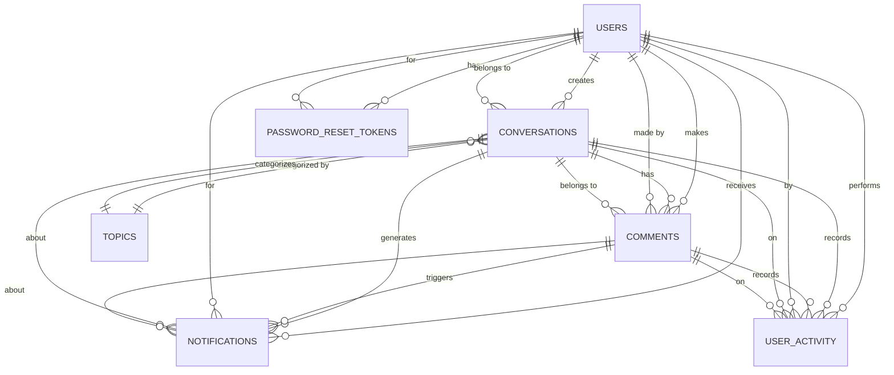

# Database Structure Documentation

This documentation outlines the database schema for the web application, detailing the tables, entities, and relationships. The database is designed using PostgreSQL and managed with Prisma ORM.

## Table of Contents

- [Entity Relationship Diagram (ERD)](#entity-relationship-diagram-erd)
- [Tables and Entities](#tables-and-entities)
  - [1. Users](#1-users)
  - [2. Conversations](#2-conversations)
  - [3. Comments](#3-comments)
  - [4. Topics](#4-topics)
  - [5. Notifications](#5-notifications)
  - [6. Password Reset Tokens](#6-password-reset-tokens)
  - [7. User Activity](#7-user-activity)
  - [8. Settings](#8-settings)
- [Relationships](#relationships)
- [Additional Notes](#additional-notes)

## Entity Relationship Diagram (ERD)

## Tables and Entities

### 1. Users

The `Users` table stores information about each registered user.

**Table Name:** `users`

| key               | Type                       | Description                                        |
| ----------------- | -------------------------- | -------------------------------------------------- |
| `id`              | Primary Key                | Unique identifier for each user                    |
| `username`        | Unique, not null           | User's chose username                              |
| `email`           | Unique, not null           | User's email address                               |
| `password_hash`   | Not null                   | Hashed password for authentication                 |
| `date_joined`     | Not null                   | Timestamp of when the user registered              |
| `last_login`      |                            | Timestamp of the user's last login                 |
| `is_active`       | Not null, default: `true`  | Indicates if the user's account is active          |
| `is_admin`        | Not null, default: `false` | Indicate if the user has administrative privileges |
| `profile_picture` |                            | URL or path to the user's profile picture          |
| `bio`             |                            | Short biography or description                     |

**Explanation:**

- Each user has a unique `id`, `username`, and `email`.
- Passwords are stored securely as hashes in `password_hash`.
- `is_admin` flag determines if the user has admin rights.
- Optional fields like `profile_picture` and `bio` allow users to personalize their profiles.

---

### 2. Conversations

The `Conversations` table stores discussion threads initiated by users.

**Table Name:** `conversations`

| key          | type                      | description                                                  |
| ------------ | ------------------------- | ------------------------------------------------------------ |
| `id`         | Primary Key               | Unique identifier for each conversation.                     |
| `user_id`    | Foreign Key, Not Null     | References `users(id)`, indicating who created the conversation. |
| `title`      | Not Null                  | Title of the conversation.                                   |
| `content`    | Not Null                  | Body content of the conversation.                            |
| `topic_id`   | Foreign Key               | References `topics(id)`, categorizing the conversation       |
| `created_at` | Not Null                  | Timestamp of creation                                        |
| `updated_at` |                           | Timestamp of the last update.                                |
| `is_pinned`  | Not Null, Default `false` | Indicates if the conversation is pinned at the top.          |

**Explanation:**

- Conversations are initiated by users (`user_id`).
- They can be categorized under a topic (`topic_id`).
- `is_pinned` allows administrators to highlight important conversations.

---

### 3. Comments

The `Comments` table stores comments made by users on conversations.

**Table Name:** `comments`

| key               | type                  | description                                                  |
| ----------------- | --------------------- | ------------------------------------------------------------ |
| `id`              | Primary Key           | Unique identifier for each comment.                          |
| `conversation_id` | Foreign Key, Not Null | References `conversations(id)`, indicating the conversation it belongs to |
| `user_id`         | Foreign Key, Not Null | References `users(id)`, indicating who made the comment      |
| `content`         | Not Null              | Content of the comment                                       |
| `created_at`      | Not Null              | Timestamp of creation.                                       |
| `updated_at`      |                       | Timestamp of the last update.                                |

**Explanation:**

- Comments are associated with a conversation and a user.
- Users can engage in discussions by adding comments to conversations.

---

### 4. Topics

The `Topics` table stores the categories used to organize conversations.

**Table Name:** `topics`

| key           | type             | description                       |
| ------------- | ---------------- | --------------------------------- |
| `id`          | Primary Key      | Unique identifier for each topic. |
| `name`        | Unique, Not Null | Name of the topic.                |
| `description` |                  | Description of the topic.         |
| `created_at`  | Not Null         | Timestamp of creation.            |
| `updated_at`  |                  | Timestamp of the last update.     |

**Explanation:**

- Topics help in categorizing conversations for better organization and searchability.
- Administrators can manage topics to ensure relevant categorization.

---

### 5. Notifications

The `Notifications` table stores notifications to keep users informed about relevant events.

**Table Name:** `notifications`

| key               | type                      | description                                                  |
| ----------------- | ------------------------- | ------------------------------------------------------------ |
| `id`              | Primary Key               | Unique identifier for each notification                      |
| `user_id`         | Foreign Key, Not Null     | References `users(id)`, indicating who receives the notification. |
| `type`            | Not Null                  | Type of notification (e.g., `reply`, `new_conversation`).    |
| `message`         | Not Null                  | Content of the notification.                                 |
| `is_read`         | Not Null, Default `false` | Indicates if the notification has been read.                 |
| `created_at`      | Not Null                  | Timestamp of creation.                                       |
| `conversation_id` | Foreign Key               | References `conversations(id)`, if applicable.               |
| `comment_id`      | Foreign Key               | References `comments(id)`, if applicable.                    |

**Explanation:**

- Notifications are sent to users to inform them about interactions like replies.
- They can be linked to specific conversations or comments.

---

### 6. Password Reset Tokens

The `Password_Reset_Tokens` table manages tokens for password recovery.

**Table Name:** `password_reset_tokens`

**Fields:**

- `id` (Primary Key): Unique identifier for each token.
- `user_id` (Foreign Key, Not Null): References `users(id)`, indicating who requested the reset.
- `token` (Unique, Not Null): Secure token used for password reset.
- `created_at` (Not Null): Timestamp of when the token was created.
- `expires_at` (Not Null): Timestamp of when the token expires.
- `is_used` (Not Null, Default `false`): Indicates if the token has been used.

**Explanation:**

- Tokens are generated when users request password resets.
- They are time-bound and single-use for security.

---

### 7. User Activity

The `User_Activity` table logs actions performed by users, useful for tracking and analytics.

**Table Name:** `user_activity`

| key               | type                  | value                                                        |
| ----------------- | --------------------- | ------------------------------------------------------------ |
| `id`              | Primary Key           | Unique identifier for each activity record.                  |
| `user_id`         | Foreign Key, Not Null | References `users(id)`, indicating who performed the activity. |
| `activity_type`   | Not Null              | Type of activity (e.g., `created_conversation`, `posted_comment`). |
| `activity_time`   | Not Null              | Timestamp of when the activity occurred.                     |
| `conversation_id` | Foreign Key           | References `conversations(id)`, if applicable.               |
| `comment_id`      | Foreign Key           | References `comments(id)`, if applicable.                    |

**Explanation:**

- Tracks user interactions for potential use in gamification or analytics.
- Helps in generating activity feeds or calculating participation levels.

---

### 8. Settings

The `Settings` table stores application-wide configurations.

**Table Name:** `settings`

**Fields:**

| key     | type             | description                         |
| ------- | ---------------- | ----------------------------------- |
| `id`    | Primary Key      | Unique identifier for each setting. |
| `key`   | Unique, Not Null | Name of the setting.                |
| `value` | Not Null         | Value of the setting.               |

**Explanation:**

- Used to store global settings, feature toggles, or default configurations.
- Allows administrators to adjust application behavior without code changes.

---

## Relationships

### Users and Conversations

- **Relationship:** One-to-Many
- **Explanation:** A user can create multiple conversations, but each conversation is created by one user.
- **Foreign Key:** `conversations.user_id` references `users.id`

### Users and Comments

- **Relationship:** One-to-Many
- **Explanation:** A user can make multiple comments, but each comment is made by one user.
- **Foreign Key:** `comments.user_id` references `users.id`

### Users and Notifications

- **Relationship:** One-to-Many
- **Explanation:** A user can receive multiple notifications, but each notification is for one user.
- **Foreign Key:** `notifications.user_id` references `users.id`

### Users and Password Reset Tokens

- **Relationship:** One-to-Many
- **Explanation:** A user can have multiple password reset tokens (e.g., multiple requests), but each token is for one user.
- **Foreign Key:** `password_reset_tokens.user_id` references `users.id`

### Users and User Activity

- **Relationship:** One-to-Many
- **Explanation:** A user can perform multiple activities, but each activity is performed by one user.
- **Foreign Key:** `user_activity.user_id` references `users.id`

### Conversations and Comments

- **Relationship:** One-to-Many
- **Explanation:** A conversation can have multiple comments, but each comment belongs to one conversation.
- **Foreign Key:** `comments.conversation_id` references `conversations.id`

### Conversations and Topics

- **Relationship:** Many-to-One
- **Explanation:** Multiple conversations can be categorized under one topic, but each conversation is categorized under one topic.
- **Foreign Key:** `conversations.topic_id` references `topics.id`

### Conversations and Notifications

- **Relationship:** One-to-Many (Optional)
- **Explanation:** A conversation can generate multiple notifications (e.g., new comment notifications), but each notification is about one conversation.
- **Foreign Key:** `notifications.conversation_id` references `conversations.id`

### Comments and Notifications

- **Relationship:** One-to-Many (Optional)
- **Explanation:** A comment can trigger multiple notifications (e.g., mentions), but each notification is about one comment.
- **Foreign Key:** `notifications.comment_id` references `comments.id`

### User Activity with Conversations and Comments

- **Relationship:** Many-to-One (Optional)
- **Explanation:** User activities may be associated with a conversation or a comment depending on the action.
- **Foreign Keys**:
  - `user_activity.conversation_id` references `conversations.id`
  - `user_activity.comment_id` references `comments.id`

## Additional Notes

### Indexing

- **Purpose:** Improves query performance, especially on columns used in WHERE clauses or joins.
- **Implementation:** Indexes are automatically created for primary keys and unique constraints. Additional indexes can be added on foreign keys and frequently queried fields.

### Data Integrity

- **Constraints:** NOT NULL, UNIQUE, and FOREIGN KEY constraints ensure data validity.
- **Cascading Actions:** Consider `ON DELETE CASCADE` or `ON DELETE SET NULL` for foreign keys if necessary to handle deletions gracefully.

### Security Considerations

- **Password Storage:** Passwords are stored as secure hashes (`password_hash`), never in plain text.
- **Input Validation:** Implement server-side validation to prevent SQL injection and XSS attacks.
- **Access Control:** Ensure proper permissions are enforced at the application level.

### Scalability

- **Future Features:** The schema is designed to accommodate future enhancements like gamification, course management, and payment processing.
- **Extensibility:** Optional fields and tables allow for additional data without significant schema changes.